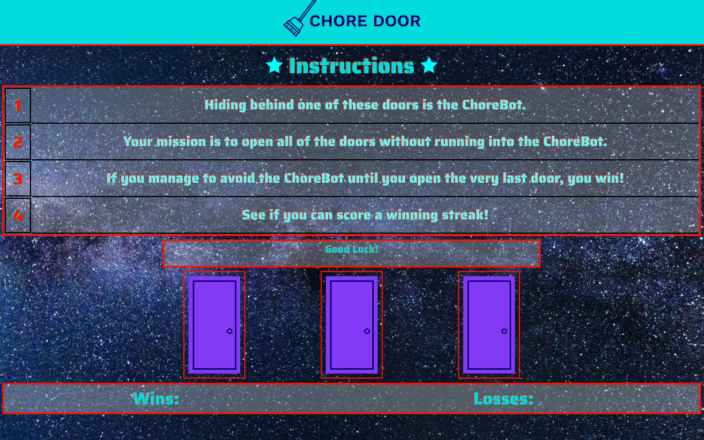

# chore-door-game

### **Description:**
Chore Door is a game of chance! The user is presented with 3 doors. Behind 1 of the doors lies "Chore-Bot", a robot who puts you to work instead of allowing you to have fun! The 2 remaining doorways lead to fun places, like a beach or space adventure. The objective of the game is to click on any 2 of the 3 doors to open them, without revealing the Chore-Bot in order to win. Player loses if Chore-Bot is revealed. The images behind the doors are randomly shuffled at the start of each round using JavaScript Logic. The players wins and losses are tracked and displayed for as long as they wish to continue playing the game.  
 

_____

### **Instructions for Playing**
* This game simple to play. Just open the game in any browser and use the instructions provided on the page to begin playing. Feeling lucky??? Give it a try! 
 
_____

### **Demo Screenshots**
#####Chore-Door
* The Game!

 
_________

### **Technologies Used**
* HTML5
* CSS
* JavaScript
* Google-Fonts
 
_____

### **Built With**
* Visual Studio Code
